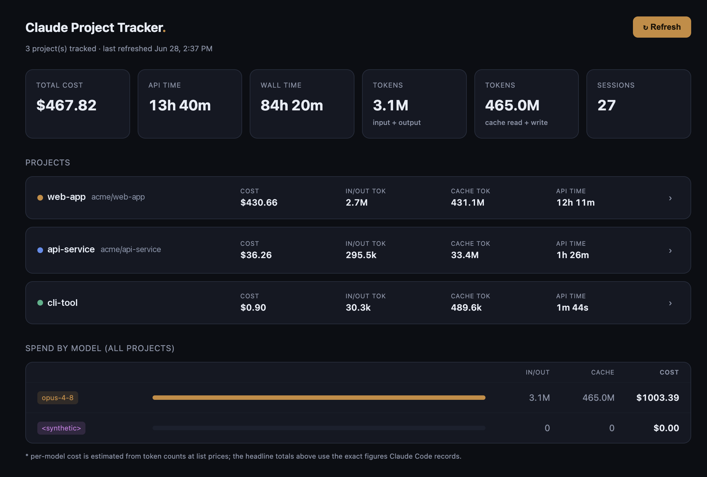

# Claude Project Tracker

A small **local** tool that turns Claude Code's own usage data into a single offline
dashboard spanning all your projects: total cost, cost per session, models used, and
tokens — overall, per project, and per session.

Nothing is hosted. Everything runs on your machine. GitHub is only the home for this
tool's source.



> Project names in the screenshot above are placeholders.

## How it works

Claude Code pipes a JSON blob to your **statusline** command on every render. That blob is
the only place it exposes `total_cost_usd` and `total_api_duration_ms`, and the values are
**cumulative per `claude` process** (they survive `/clear` and `/compact`, and reset only
when you launch a fresh `claude`). The tool:

1. **Captures** that blob from the statusline (only for projects you opt in), appending one
   throttled line per turn to the project's `usage.jsonl`.
2. **Aggregates** on demand: it segments each project's samples into **sessions** wherever
   cumulative cost drops (= a new process), pulls cost / API-time / wall-time / lines from
   the blob, and joins **token counts per model** from the transcript files.
3. **Serves** a local dashboard with a Refresh button.

A "session" = one `claude` process, launch → exit — the same unit `/usage` shows.

## Requirements

- **Python 3.8+** (standard library only — no `pip install`, no `jq`).
- A Claude Code **statusline** with the capture step wired in. The installer sets this up
  for you, creating one if you don't have any.

## Setup

Inside each project you want to track, on Day 0:

```bash
~/claude-project-tracker/install.sh
```

This (a) wires capture into your statusline the first time — creating a minimal statusline
if none exists, or wrapping your existing one (the original is kept as `*.orig.sh` plus a
timestamped backup) — and (b) opts this project in. Then just use Claude in the project as
normal.

To only (re)wire the statusline without opting a project in:

```bash
~/claude-project-tracker/install.sh --setup-statusline
```

## Viewing the dashboard

```bash
python3 ~/claude-project-tracker/tracker.py
```

It builds the data, starts a localhost server, and opens your browser. Click **Refresh**
anytime to rebuild from the latest logs. Press Ctrl-C in the terminal to stop.

`install.sh` adds a `tracker` alias to your shell profile, so after opening a new terminal
you can just run:

```bash
tracker
```

If capture isn't set up yet, `tracker.py` won't render an empty page — it tells you exactly
what to add and how to auto-fix it.

## Where data lives

- Raw per-project logs: `~/.claude/projects/<project>/usage-tracker/usage.jsonl`
  (next to Claude's transcripts — **outside** this repo, never committed).
- The generated `web/data.js` is local and git-ignored.

The repo contains only the tool's code.

## Notes

- Per-model **cost** is *estimated* from token counts at list prices; the headline totals
  use the exact figures Claude Code records.
- No historical backfill: tracking starts the day you opt a project in. Past `claude`
  processes can't be reconstructed because nothing on disk links a `/clear`'d conversation
  back to its original process.
